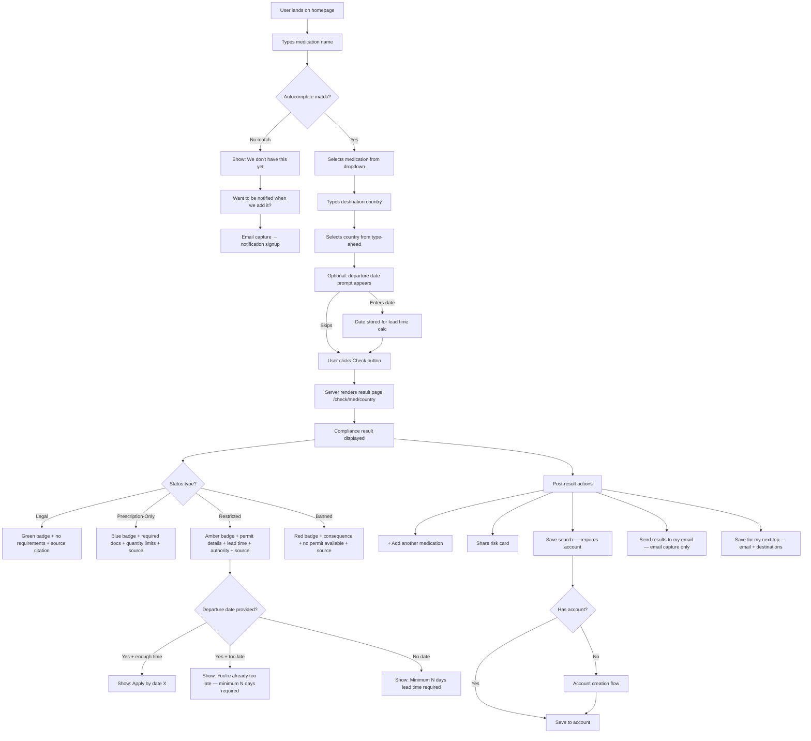
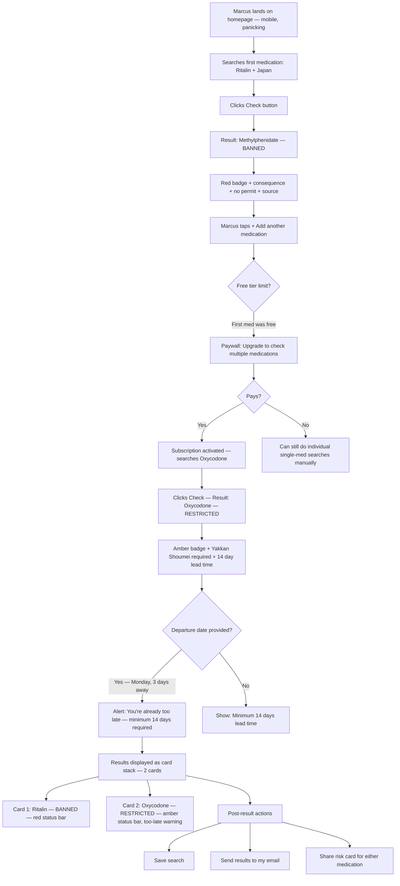
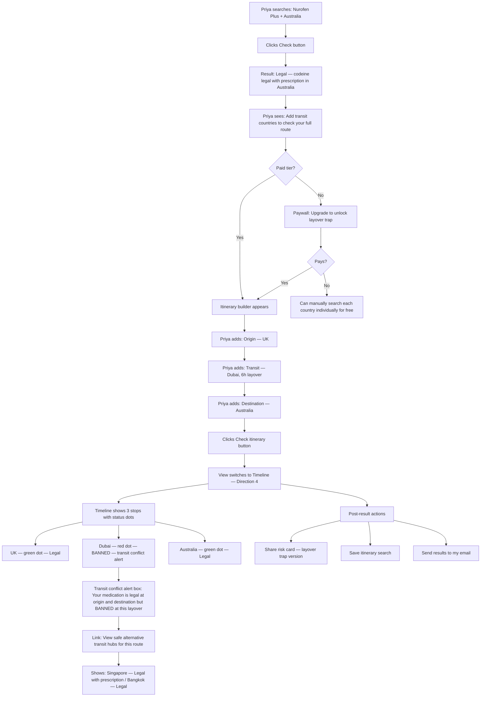
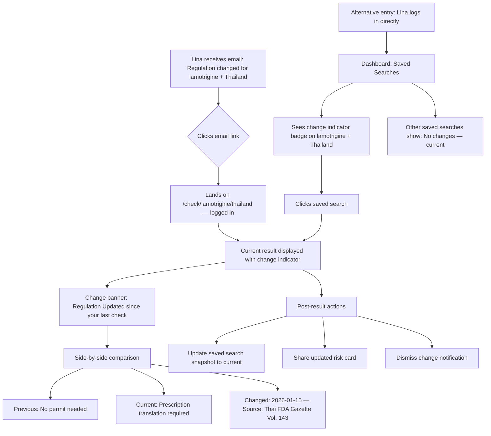
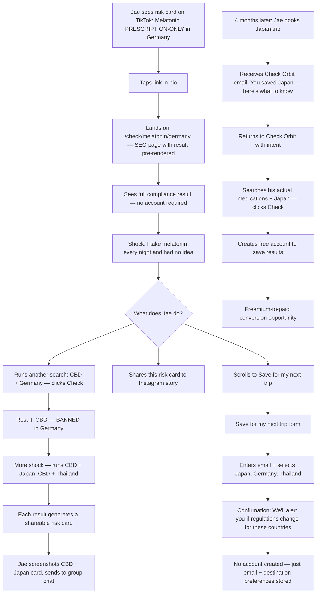
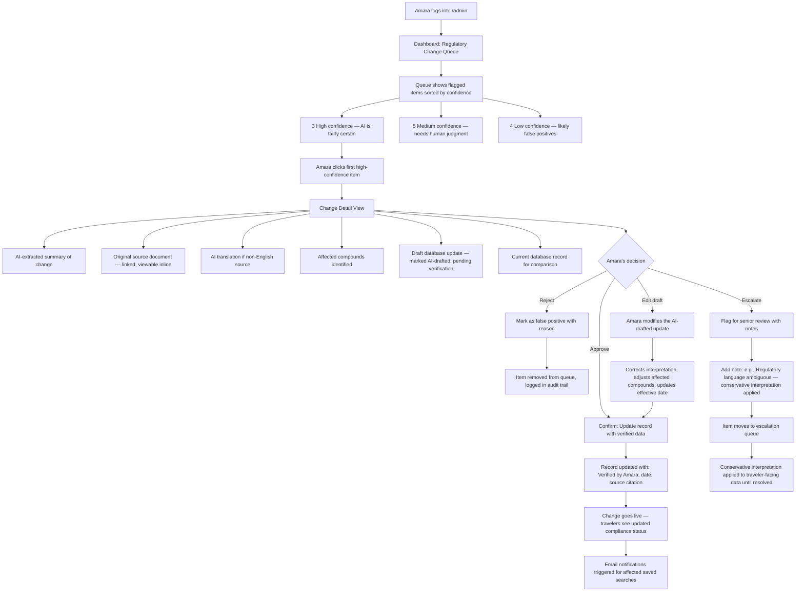
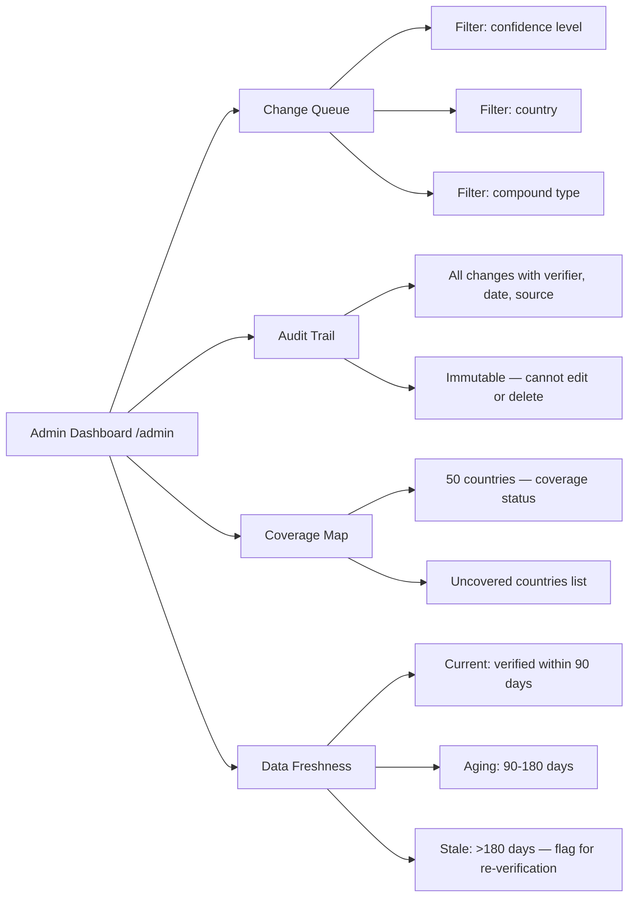

# UX Design Specification - Check Orbit

**Author:** Trish
**Date:** 2026-03-26

---

<!-- UX design content will be appended sequentially through collaborative workflow steps -->

## Executive Summary

### Project Vision

Check Orbit is a travel medication compliance web application that gives travelers instant, verified compliance answers for any medication, supplement, or vitamin-destination pair. The product is a confidence product — delivering verified certainty with source citations rather than raw data travelers could theoretically find through hours of unreliable research. The core moat is a compound-first regulatory database that decomposes medications to active ingredients and cross-references each against per-country regulations at the dosage-threshold level, covering the top 50 destination countries at launch.

The product serves a dual-channel strategy: B2C direct traveler search with SEO and social virality as acquisition engines, and B2B2C privacy-safe institutional screening for universities, insurers, and travel management companies. The MVP prioritizes the full B2C experience and the underlying data infrastructure that makes all future channels possible.

### Target Users

**Primary B2C Users (MVP):**

- **Calm Planners (Emma)** — First-time or occasional international travelers with weeks of lead time. Need reassurance, clear next steps, and permit timeline guidance. Likely discover via SEO or word of mouth.
- **Panic Gap Users (Marcus)** — Travelers discovering medication risks 24-72 hours before departure. High cognitive load, mobile-first, need immediate clarity even when the news is bad. Highest willingness to pay.
- **Layover Trap Users (Priya)** — Experienced travelers unaware that transit countries pose medication risks. The product's killer differentiator serves this user — they don't know they need it until they see it.
- **Returning Users (Lina)** — Frequent travelers who check regulations before each trip. Value saved search snapshots, regulation-change alerts, and quick re-verification. Primary freemium-to-paid conversion targets.
- **Social Discovery Users (Jae)** — Casual users who encounter Check Orbit through viral risk cards on TikTok/Instagram. Not traveling immediately but shocked enough to save destinations for later. Entry point to the acquisition funnel.

**Secondary Users (Phase 2+):**

- **University Administrators (David)** — Institutional buyers who need privacy-safe student medication screening at scale.

**Internal Users (MVP):**

- **Data Curators (Amara)** — Regulatory data analysts managing database accuracy through AI-flagged verification workflows.

### Key Design Challenges

1. **Emotional design for high-stakes bad news** — The UX must deliver devastating news (medication banned, no workaround, you're already too late for a permit) clearly without causing additional panic. Clinical communication precision required.
2. **Two-speed user context** — Calm planners and panic-gap users arrive with radically different cognitive loads and time pressures. The same mobile-first interface must serve methodical research and emergency triage.
3. **Trust at first glance** — YMYL product where wrong information has severe consequences. Every result must visually communicate authority, source verification, and data freshness instantly. Must outperform forum credibility on first visit.
4. **Freemium boundary design** — Free tier hooks with the alarming discovery; paid tier unlocks the full solution. The paywall must feel like it unlocks capability, not gates critical safety information.
5. **Supplement ambiguity communication** — Proprietary blends with undisclosed ingredients can't be fully verified. Must communicate verification gaps honestly without undermining confidence in verified results.

### Design Opportunities

1. **Shareable "aha" moments as acquisition** — Surprising compliance facts and the layover trap create inherently viral content. Risk cards designed for social dimensions turn every search into a distribution event.
2. **Regulation-change comparison as retention** — Saved search snapshot comparison ("what changed since you last checked") is a novel interaction pattern that creates genuine return-visit motivation.
3. **Progressive disclosure for complex results** — Layered information architecture (clear status → details on expand → source citations) makes multi-compound, multi-country complexity feel manageable.
4. **Stateless privacy as visible trust signal** — "We never store your medication data" is a UX message and design element, not just a technical footnote. Visible privacy architecture builds confidence.

## Core User Experience

### Defining Experience

The core experience is the compliance search — a traveler enters a medication name and destination country and receives a clear, verified compliance status. This is the atomic unit of value. Every other feature (layover trap, saved searches, risk cards, notifications) is a layer built on top of this single interaction.

The search must be the fastest path from uncertainty to certainty. A traveler arrives anxious and leaves informed. The interaction is: type a medication name, select a country, see a status. Three inputs, one answer. Everything else is progressive disclosure from that answer.

### Platform Strategy

- **Multi-page responsive web application** — mobile-first, server-rendered for SEO
- **No native app** — the web handles all use cases including panic-gap mobile searches
- **Touch and keyboard** — mobile (panic gap, social discovery) and desktop (calm planning, institutional use) are equally important input modes
- **Offline: download only** — core search requires connectivity; customs cards and risk cards work offline once downloaded as images or PDFs
- **SEO as platform** — every medication-country pair generates an indexable page. The URL structure (`/check/adderall/japan`) IS the product's distribution platform. Server rendering is not a performance optimization — it's an acquisition strategy
- **Social platforms as distribution surface** — risk cards are designed as native content for TikTok/Instagram, linking back to the full compliance page

### Effortless Interactions

- **Search input** — type-ahead, fuzzy matching, brand-to-generic resolution. A traveler who types "Advil" should never need to know it contains ibuprofen. A traveler who misspells "sertraline" should still find it.
- **Country selection** — fast, forgiving, mobile-friendly. No scrolling through 200 countries in a dropdown.
- **Result comprehension** — the compliance status (Legal / Prescription-Only / Restricted / Banned) must be understood in under 2 seconds, with required documentation, quantity limits, permit requirements, and lead times immediately visible without additional clicks. No interpretation required. No ambiguity. No hunting for the actionable details.
- **Repeat searches** — adding a second medication or a second country to an existing search should feel like extending a thought, not starting over.
- **Sharing** — one tap from result to shareable risk card. Zero friction between "I can't believe this" and "I need to tell someone."

### Critical Success Moments

1. **First search result** — the moment a traveler sees their first compliance status is where trust is won or lost. If the result feels authoritative, cited, and clear, the product earns credibility for everything that follows. If it feels thin, generic, or uncertain, no feature will recover that trust.
2. **The "I didn't know that" moment** — when a traveler discovers something surprising (melatonin is prescription-only in Germany, codeine is banned in the UAE). This is the emotional hook that drives sharing, return visits, and word of mouth.
3. **The bad news delivery** — when the status is Banned or "you're already too late." This moment must be handled with clinical precision — clear, factual, no sugar-coating, but also no panic amplification. The product's character is defined by how it handles the worst answer.
4. **The layover reveal** — when a traveler who thought they were safe discovers their transit country is the problem. This is Check Orbit's signature moment — the feature no competitor offers — and it must land with clarity and impact.

### Experience Principles

1. **Certainty over completeness** — a confident, cited answer for one medication-country pair is worth more than vague coverage of everything. When we can't verify, say so explicitly rather than hedging.
2. **Clarity is kindness** — in high-stakes compliance, removing ambiguity IS the product. Four statuses, not five. Source citations, not disclaimers. "Banned" not "may be restricted in some jurisdictions."
3. **Speed is trust** — the faster the answer appears, the more authoritative it feels. A 2-second result with a source citation feels more trustworthy than a 10-second result with the same information.
4. **The search is the product** — every design decision should be evaluated by whether it makes the core search faster, clearer, or more trustworthy. Features that don't serve the search are secondary.
5. **Show the work** — source citations, verification dates, and government document links are not fine print — they are core UI elements. Transparency is the trust mechanism.

## Desired Emotional Response

### Primary Emotional Goals

- **Clarity in crisis** — the primary emotional goal. Whether a traveler has 3 weeks or 3 hours, the product delivers the same thing: unmistakable clarity. Not comfort, not reassurance — clarity. The emotional experience is "now I know exactly where I stand."
- **Confidence through evidence** — the feeling that differentiates Check Orbit from Googling it. Forum posts leave travelers more anxious than when they started. Check Orbit replaces anxiety with confidence backed by cited government sources and verification dates.
- **Shock as discovery** — the "I had no idea" moment that drives sharing. Melatonin prescription-only in Germany. CBD banned across Asia. Codeine illegal at your layover. These surprising facts are the emotional engine of virality.

### Emotional Journey Mapping

| Stage | Emotional State | Design Implication |
|---|---|---|
| **Arrival** | Anxious, uncertain, possibly panicking | Immediate search input — no onboarding walls, no marketing copy between the user and the answer |
| **Search** | Hopeful, impatient | Speed is emotional — fast results feel authoritative; slow results amplify anxiety |
| **Good news result** | Relief, confidence | Clear "Legal" status with source citation converts anxiety into trust instantly |
| **Bad news result** | Disappointed but informed | Direct, factual, no softening language. "Banned" not "may present challenges." The user feels respected, not patronized |
| **"Too late" result** | Frustrated but grateful | The product didn't cause the problem — it prevented a worse one. Frame as "you now know" not "you failed to plan" |
| **Layover reveal** | Shocked, then grateful | The signature emotional beat. "I had no idea my layover was a problem" followed by "thank god I checked" |
| **Sharing** | Compelled, protective | "My friends need to know this" — sharing driven by shock and care, not product loyalty |
| **Return visit** | Efficient, trusting | Returning users expect the same clarity, faster. Saved searches and change indicators reward loyalty |

### Micro-Emotions

**Critical to get right:**
- **Confidence over comfort** — users should feel certain, not soothed. The product is a diagnostic tool, not a reassurance machine.
- **Trust over delight** — there are no playful animations when someone learns their ADHD medication is banned. Trust is earned through precision, not personality.
- **Respect over empathy** — delivering bad news clearly IS the empathetic act. Softening the language to protect feelings would be disrespectful to a traveler who needs to act on the information.

**Emotions to actively avoid:**
- **Panic** — bad news must never amplify fear. Clear language and next steps prevent escalation.
- **Confusion** — any moment of "wait, what does this mean?" is a design failure.
- **Doubt** — if a user questions whether the information is accurate, the product has failed. Source citations and verification dates exist to prevent this.
- **Guilt** — "you're already too late" must never feel like blame. The framing is informational, not judgmental.

### Design Implications

- **Clarity in crisis** → minimal UI, high-contrast status indicators, no decorative elements competing with the answer. The result is the hero — everything else is support.
- **Confidence through evidence** → source citations, verification dates, and government document links are primary UI elements, not footnotes. They sit alongside the status, not below the fold.
- **Shock as discovery** → risk cards must be visually arresting — bold status, country flag, medication name — designed to stop a social media scroll. The "I can't believe this" moment must survive screenshot compression.
- **Disappointed but informed** → bad news results include immediate next steps (alternative transit hubs, permit application links, "talk to your doctor" guidance). The emotional arc is: bad news → but here's what you can do → you're now better off than before you checked.
- **No false warmth** → the tone is authoritative and direct. No "We're sorry to tell you..." or "Unfortunately..." — just "Banned. Japan prohibits methylphenidate regardless of prescription." The product respects the user's intelligence and urgency.

### Emotional Design Principles

1. **Direct is compassionate** — in high-stakes compliance, clarity IS the kindest design choice. Never soften, hedge, or bury the lead.
2. **Evidence is emotion** — a source citation and verification date do more for user confidence than any reassuring copy or friendly illustration.
3. **Shock is shareable** — surprising facts are the product's organic growth engine. Design for the screenshot, the group chat forward, the TikTok greenscreen.
4. **Bad news is a feature** — the product's character is defined by how it handles the worst answer. A product that delivers bad news well earns the right to be trusted with good news.
5. **Speed is calm** — in the panic gap, every second of loading is a second of escalating anxiety. Fast results are emotionally superior results.

## UX Pattern Analysis & Inspiration

### Inspiring Products Analysis

**Airbnb — Complex Input, Consumer-Friendly**

Airbnb takes inherently complex search parameters (dates, locations, guest counts, accessibility needs, property types, price ranges) and makes them feel conversational. Key UX wins:
- **Progressive input collection** — doesn't ask for everything upfront. Location first, then dates, then guests. Each step feels like a natural next question.
- **Multi-stop logic** — Airbnb Experiences and multi-city trip planning handle sequential location logic cleanly. Directly relevant to Check Orbit's layover trap itinerary input.
- **Filter constraints that don't overwhelm** — highly specific filtering (wheelchair accessible, pet-friendly, pool, superhost) presented as toggles and chips, not form fields. Complex queries feel simple.
- **Mobile-first search** — the search experience on mobile is as powerful as desktop, just differently presented. Touch-optimized inputs with generous tap targets.
- **Map + list dual view** — spatial and textual information presented simultaneously. Relevant to how Check Orbit might display multi-country itinerary results.

**Sherpa — Travel Compliance Search Done Right**

Sherpa is the closest UX precedent to Check Orbit — replacing dense government embassy pages with a simple origin-to-destination search for visa and entry requirements. Key UX wins:
- **Origin → Destination search model** — simple two-field search that mirrors how travelers think. Directly transferable to Check Orbit's medication + country input.
- **Green/Yellow/Red status badging** — clear, instant-read compliance status. "eVisa Required," "Entry Open," "Entry Restricted." Check Orbit's four-status model (Legal/Prescription-Only/Restricted/Banned) can learn from this visual language.
- **Replaces government pages** — the core value proposition is identical to Check Orbit's: structured, verified data replacing hours of unreliable government PDF reading.
- **Trust through specificity** — Sherpa earns trust by showing exactly which documents are required, not just whether entry is allowed. Check Orbit must do the same with permit requirements, quantity limits, and documentation.

**Wealthsimple — Bad News Delivery in High-Stakes Context**

Wealthsimple regularly delivers devastating financial news — portfolio drops, tax obligations — in a context where the user's emotional state is already fragile. Key UX wins:
- **Clean, minimal interface for heavy information** — when showing a 15% portfolio loss, the UI doesn't add visual noise. The number is the number. White space and typography do the emotional work.
- **Factual without editorial** — Wealthsimple shows the loss, not "unfortunately your portfolio has declined." The data speaks. No softening copy, no false optimism.
- **Context alongside the bad news** — alongside a loss, they show historical performance, market context, and long-term trajectory. Bad news is delivered with enough context to prevent panic without minimizing reality.
- **Actionable next steps** — Wealthsimple Tax tells you what you owe AND how to pay it. The emotional arc is: bad news → here's the context → here's what to do. Directly transferable to Check Orbit's "Banned → here's why → here's what you can do instead" pattern.
- **No personality in crisis moments** — Wealthsimple's brand is warm and approachable in onboarding and marketing. But when delivering bad news, the tone shifts to clinical precision. The brand knows when to step back and let the information lead.

### Transferable UX Patterns

**Navigation & Input Patterns:**
- **Airbnb's progressive input** → Check Orbit search: medication first, then country, then optional departure date. Each field a natural next question, not a form to fill out.
- **Sherpa's two-field search** → validates that origin → destination is the right mental model for compliance search. Check Orbit's medication → country follows the same cognitive pattern.
- **Airbnb's multi-stop logic** → directly transferable to layover trap itinerary builder. Add stops sequentially, reorder, remove — the interaction should feel identical to planning Airbnb stays across cities.

**Status & Result Patterns:**
- **Sherpa's Green/Yellow/Red badging** → Check Orbit's four-status model needs the same instant-read visual clarity. Color + icon + text label, all reinforcing the same message. The status must be comprehensible before the user reads any supporting text.
- **Wealthsimple's contextual bad news** → Check Orbit's Banned/Restricted results should follow the same pattern: status → context (why, which authority) → next steps (alternatives, permit process, doctor consultation).

**Information Architecture Patterns:**
- **Airbnb's progressive disclosure** → Check Orbit results: status badge visible immediately, required documents and quantity limits visible without scrolling, source citations and permit details available on expand. Layered depth without hiding critical information.
- **Wealthsimple's minimal UI for heavy information** → compliance results should have generous white space, clear typography hierarchy, and zero decorative elements competing with the status. The result IS the UI.

**Emotional Design Patterns:**
- **Wealthsimple's tonal shift** → Check Orbit can be warm and approachable in marketing, onboarding, and the "save for my next trip" flow. But the compliance result screen is clinical. The brand personality steps back when the stakes are high.
- **Sherpa's trust through specificity** → every compliance result must show the specific authority, specific document required, specific quantity limit. Vagueness destroys trust. Specificity builds it.

### Anti-Patterns to Avoid

- **Government website complexity** — dense text walls, buried PDFs, jargon-heavy language. Check Orbit exists because these are unusable. Never replicate their information architecture.
- **Forum-style uncertainty** — Reddit threads and travel forums create MORE anxiety than they resolve. Conflicting advice, outdated information, no source verification. Check Orbit must feel like the opposite of a forum answer.
- **Over-designed compliance UX** — scores, percentages, gauges, or gamification applied to compliance status. The brainstorming session explicitly rejected this ("overdone"). Four clear statuses, not a compliance score.
- **Paywall before the answer** — showing "we have your result, pay to see it" destroys trust in a high-stakes context. The free tier must show the status and core details. The paywall unlocks capability (multi-med, layover trap, saves), not the answer itself.
- **False warmth in crisis moments** — "We're sorry to inform you..." or friendly illustrations alongside devastating news. Wealthsimple proves that clinical precision is more respectful than artificial empathy.
- **Dropdown country selectors** — scrolling through 200+ countries in a mobile dropdown is hostile UX. Airbnb and Sherpa both use searchable, type-ahead country selection. Non-negotiable for Check Orbit.

### Design Inspiration Strategy

**What to Adopt:**
- Sherpa's two-field search model and color-coded status badging — proven in the compliance space, directly transferable
- Wealthsimple's bad-news delivery pattern: fact → context → next steps, with minimal UI and zero editorial softening
- Airbnb's progressive input collection — medication first, country second, optional fields after

**What to Adapt:**
- Airbnb's multi-stop itinerary builder → simplified for medication compliance context (countries only, no dates/guests/property types)
- Sherpa's Green/Yellow/Red → expanded to four statuses (Legal/Prescription-Only/Restricted/Banned) with a biosecurity warning overlay
- Wealthsimple's contextual framing → adapted from financial context (historical performance) to compliance context (source citations, verification dates, alternative transit hubs)

**What to Avoid:**
- Government website information architecture — Check Orbit is the antidote, not a replica
- Forum-style hedging and uncertainty — every result must feel definitive or explicitly state "unable to verify"
- Compliance scoring or gamification — clarity beats cleverness when detention is the consequence
- Personality or warmth in result delivery — clinical precision is the emotional design choice

## Design System Foundation

### Design System Choice

**shadcn/ui** with **Next.js (App Router)** stack.

shadcn/ui is a collection of re-usable, accessible components built on Radix UI primitives and styled with Tailwind CSS. Unlike traditional component libraries, shadcn/ui components are copied into the project — giving full ownership and customization control without library dependency lock-in.

### Rationale for Selection

- **Clinical aesthetic control** — shadcn/ui's default design language is clean, minimal, and typographically precise. It avoids Material Design's opinionated personality and consumer-app feel. The components start neutral and can be tuned toward the authoritative, high-trust visual identity Check Orbit requires.
- **Server-rendering native** — Next.js App Router with React Server Components delivers the SEO performance Check Orbit depends on. Every medication-country compliance page is server-rendered and indexable. No hydration penalty on content pages.
- **Solo founder speed** — shadcn/ui provides production-ready, accessible components (dialogs, dropdowns, search inputs, cards, badges, tables) without building from scratch. The AI-assisted development workflow is well-supported — shadcn/ui is one of the most widely adopted systems in AI-generated codebases.
- **Tailwind CSS foundation** — utility-first styling enables rapid iteration on visual design without fighting CSS abstractions. Design tokens (colors, spacing, typography) are defined once in the Tailwind config and propagated consistently.
- **Accessibility built-in** — Radix UI primitives handle keyboard navigation, focus management, screen reader support, and ARIA attributes. Critical for WCAG 2.1 AA compliance (NFR26-30) without manual implementation.
- **No library lock-in** — components are owned, not imported. If a component needs modification for Check Orbit's specific needs (e.g., a custom status badge, a compliance result card), the code is in the project and fully editable.

### Implementation Approach

- **Next.js App Router** — server components for all SEO-critical pages (medication-country compliance pages, debunking landing pages, coverage maps). Client components only where interactivity requires it (search input, itinerary builder, account management).
- **shadcn/ui components** — adopt the component set as the baseline UI kit. Core components needed: Input (search), Command (type-ahead medication/country selection), Badge (status indicators), Card (compliance results), Dialog (modals), Table (itinerary results), Tabs, Toast (notifications).
- **Tailwind CSS** — define a custom design token layer in `tailwind.config` for Check Orbit's brand colors (status colors for Legal/Prescription-Only/Restricted/Banned), typography scale, spacing, and breakpoints.
- **Dynamic routing** — Next.js dynamic routes for `/check/[medication]/[country]` URL structure, server-rendered with ISR (Incremental Static Regeneration) for SEO-indexed compliance pages.

### Customization Strategy

- **Status color system** — define a four-color semantic palette mapped to compliance statuses (Legal, Prescription-Only, Restricted, Banned) plus a biosecurity warning overlay color. These are the product's visual signature and must be distinct, accessible (colorblind-safe), and instantly readable.
- **Typography hierarchy** — establish a typographic scale that supports clinical precision: clear heading hierarchy for result pages, monospace or tabular figures for permit lead times and dates, high-legibility body text for source citations.
- **Component extensions** — build Check Orbit-specific components on top of shadcn/ui primitives: ComplianceStatusBadge, ComplianceResultCard, ItineraryTimeline, SourceCitation, RiskCard (shareable), PermitLeadTimeAlert.
- **Dark mode consideration** — defer dark mode to post-MVP. The clinical, trust-forward aesthetic is easier to establish in a light theme first. Ensure Tailwind config supports future dark mode addition without redesign.

## Defining Experience

### The Core Interaction

**"Search your meds, see if they're legal at your destination."**

This is how users will describe Check Orbit to friends. The defining experience is a two-field search — medication first, country second — that returns an instant, cited compliance status. The interaction pattern mirrors Sherpa's origin → destination model but applied to pharmaceutical compliance.

The product exists because most travelers don't know to check until it's too late — and the ones who do know are aware that rules change between countries. Check Orbit catches both: the first-timer who has never considered the problem and the experienced traveler who checked last time but is going somewhere new.

### User Mental Model

**Travelers think medication-first, not destination-first.** The anxiety starts with "is MY medication okay?" not "what are Japan's rules?" The search flow follows this mental model:

1. **"What am I taking?"** → type medication name (autocomplete)
2. **"Where am I going?"** → select destination country (type-ahead)
3. **"Am I okay?"** → see compliance status with full details

This is the cognitive sequence of a worried traveler. The UI follows their thought process, not a database schema.

**Current solutions and why they fail:**
- **Googling** — conflicting forum posts, expired PDFs, Reddit threads from 2019. Creates more anxiety than it resolves.
- **Government websites** — dense legal text in local languages, buried in ministry sites. Assumes the traveler knows which agency to check and can interpret regulatory language.
- **Asking a doctor** — doctors know medications, not international customs law. They can write a prescription letter but can't tell you if Japan bans your compound outright.
- **Not checking at all** — the most common "solution." Travelers either don't know to check or give up trying and either skip their meds or take the risk.

Check Orbit replaces all of these with a single interaction that takes seconds.

### Success Criteria

- **Time to answer:** < 20 seconds from first keystroke to full compliance result
- **Zero interpretation required:** the status (Legal / Prescription-Only / Restricted / Banned) is understood without reading supporting text
- **Full actionable picture visible immediately:** status, required documentation, quantity limits, permit requirements, and lead times all visible without additional clicks
- **Source trust:** government source citation and verification date visible alongside every result
- **Multi-medication natural flow:** after seeing the first result, adding another medication feels like extending the conversation, not restarting it
- **Graceful gaps:** when a medication isn't recognized, the user gets a path forward ("we don't have this yet — want to be notified when we add it?"), not a dead end

### Novel UX Patterns

**Established patterns adopted:**
- **Two-field search** — proven by Sherpa, Google Flights, and every travel search tool. Users understand "enter thing + enter place = get answer."
- **Autocomplete with type-ahead** — standard for medication and location selection. Users expect suggestions as they type.
- **Color-coded status badges** — Sherpa's Green/Yellow/Red pattern extended to four statuses. Instant visual comprehension.

**Novel patterns introduced:**
- **Compound decomposition transparency** — when a user searches "Nurofen Plus," the result shows it was decomposed into ibuprofen (Legal) + codeine (Banned). This is educational — the user learns WHY their medication is flagged, not just that it is. No existing tool does this.
- **Layover trap reveal** — multi-stop itinerary input that flags transit country conflicts. The "your layover is the problem" moment is a genuinely new interaction pattern with no precedent in consumer travel tools.
- **"Add another medication" progressive search** — the core search naturally invites adding more medications after the first result, building a per-trip medication compliance profile without requiring upfront list entry.
- **Medication not found as lead capture** — unrecognized medications don't dead-end. They convert to a notification signup ("we'll let you know when we add this"), turning a coverage gap into a user relationship.

### Experience Mechanics

**1. Initiation:**
- User lands on the page — search input is the hero element, immediately visible, no scroll required
- On SEO landing pages (`/check/adderall/japan`), the result is already rendered — the search input is secondary, pre-filled, and editable
- On social landing pages (from risk card links), the specific compliance result is shown with the search input available to check other medications

**2. Interaction:**
- **Medication input:** user types → autocomplete dropdown appears showing matching medications with generic/compound names (e.g., "Zoloft (sertraline)"). Selection locks the medication.
- **Country input:** user types → type-ahead country selector appears. Popular destinations weighted higher. Selection locks the country.
- **Optional departure date:** inline prompt appears after country selection — "When do you depart? (optional — enables permit deadline alerts)." Not required, not blocking.
- **Submit:** search executes only when the user clicks the "Check" button (UX-DR3). The button appears once both medication and country fields are filled. In a high-stakes compliance context, intentional submission respects the weight of the answer. If departure date is added, results include time-sensitive alerts.

**3. Feedback:**
- **Instant result:** compliance status badge appears with color and text label — Legal (green), Prescription-Only (amber), Restricted (orange), Banned (red)
- **Compound decomposition:** if the medication contains multiple active compounds, each compound's status is shown independently. The overall status reflects the most restrictive compound.
- **Actionable details visible immediately:** required documents, quantity limits, permit authority, lead time — all visible without expanding or clicking
- **Source citation:** government source, verification date, and link to original document visible alongside the result
- **Biosecurity overlay:** if applicable, a separate warning flag for plant-derived/animal-derived ingredient restrictions
- **No match found:** "We don't have [medication name] in our database yet. Want to be notified when we add it?" with email capture

**4. Completion & Next Steps:**
- **"Add another medication"** — a clear, inviting prompt to check additional medications against the same destination. Feels like continuing the conversation.
- **"Check another country"** — switch destination without re-entering medications. Enables the layover discovery moment.
- **"Add transit countries"** (paid tier) — expand to multi-stop itinerary for layover trap analysis
- **Share this result** — one-tap risk card generation for social sharing
- **Save this search** — save to account for future re-checking and regulation-change alerts
- **"Save for my next trip"** — for discovery-mode users not traveling yet, email capture with destination interest

## Visual Design Foundation

### Color System

**Brand Palette:**

| Role | Color | Approximate Value | Tailwind Mapping | Usage |
|---|---|---|---|---|
| Primary | Burnt Orange | #DE6438 | `brand-500` | Navigation, primary buttons, links, brand identity |
| Primary Light | Soft Apricot | #E8A972 | `brand-200` | Hover states, secondary buttons, warm backgrounds |
| Secondary | Steel Blue | #5B9BC5 | `brand-blue` | Trust elements, source citations, secondary actions |
| Secondary Light | Ice Blue | #BDD9F0 | `brand-blue-100` | Backgrounds, secondary surfaces, information panels |
| Accent | Marigold Gold | #DDB943 | `accent-gold` | Highlights, featured elements, premium tier indicators |

**Brand Palette Character:** Warm, bold, travel-forward. The burnt orange leads with energy and confidence — it's the color of adventure, not caution. The steel blue provides trust and authority as a secondary tone, anchoring credibility where needed (source citations, verification badges). The warm supporting tones (apricot, marigold) create a cohesive warm palette that feels approachable and human.

**Status Color System (Compliance Results):**

| Status | Meaning | Color Name | Background | Border | Text |
|---|---|---|---|---|---|
| Legal | Unrestricted, safe to carry | Muted Sage Green | `bg-emerald-50` | `border-emerald-200` | `text-emerald-700` |
| Prescription-Only | Legal with proof of medical necessity | Calm Cyan / Sky Blue | `bg-sky-50` | `border-sky-200` | `text-sky-700` |
| Restricted | Legal with permits, quantity limits, or strict biosecurity rules | Warm Amber / Ochre | `bg-amber-50` | `border-amber-200` | `text-amber-700` |
| Banned | Illegal, confiscation and detention risk | Soft Terracotta / Rose | `bg-rose-50` | `border-rose-200` | `text-rose-700` |

**Status Color Rationale:**
- **Green (Legal)** — universal "safe" signal. Muted sage avoids feeling celebratory — this is confirmation, not congratulation.
- **Blue (Prescription-Only)** — naturally implies "medical" or "doctor" without implying danger. Distinct from the brand blues through the sky/cyan hue.
- **Amber (Restricted)** — universal caution signal. Warm ochre tone aligns with the brand's warm personality while clearly communicating "action required."
- **Rose (Banned)** — soft terracotta rather than aggressive red. Communicates "stop" firmly without triggering panic — aligns with the emotional design principle of "disappointed but informed."

**Biosecurity Warning Overlay:** A distinct visual treatment (e.g., dashed border, secondary icon) layered on top of any status to indicate biosecurity restrictions independent of pharmaceutical compliance. Not a fifth color — an overlay pattern.

**Separation Principle:** Brand palette and status colors are intentionally independent systems. Brand colors handle identity (navigation, buttons, backgrounds, marketing surfaces). Status colors handle compliance results exclusively. They coexist without collision — the burnt orange brand primary (`#DE6438`) is visually distinct from the rose/terracotta status color (`bg-rose-50` / `text-rose-700`) — the brand orange is bold and saturated for identity, while the Banned status rose is muted and soft for clinical communication.

### Typography System

**Visual Tone:** Modern tech product — clean, precise, high-legibility. Not medical or clinical in typography; the precision comes from information design, not font choice.

**Primary Typeface:** Inter (or system font stack as fallback)
- Modern, highly legible sans-serif optimized for screen reading
- Excellent support for tabular/monospace figures (critical for permit lead times, dates, quantity limits)
- Wide weight range (400–700) supports clear typographic hierarchy
- shadcn/ui default — zero additional font loading overhead

**Type Scale:**

| Element | Size | Weight | Usage |
|---|---|---|---|
| Page Title (h1) | 2rem / 32px | 700 (Bold) | Page headings, landing page hero |
| Section Title (h2) | 1.5rem / 24px | 600 (Semibold) | Result section headers, feature sections |
| Subsection (h3) | 1.25rem / 20px | 600 (Semibold) | Compound breakdown headers, card titles |
| Body | 1rem / 16px | 400 (Regular) | Primary content, descriptions, documentation details |
| Body Small | 0.875rem / 14px | 400 (Regular) | Source citations, verification dates, secondary information |
| Caption | 0.75rem / 12px | 500 (Medium) | Timestamps, metadata, disclaimer text |
| Status Label | 0.875rem / 14px | 700 (Bold) | Compliance status text within badges (LEGAL, BANNED, etc.) |
| Tabular Figures | 0.875rem / 14px | 500 (Medium) | Permit lead times, quantity limits, dates — using `font-variant-numeric: tabular-nums` |

**Line Heights:**
- Headings: 1.2–1.3 (tight, for visual impact)
- Body text: 1.5–1.6 (generous, for readability in information-dense layouts)
- Captions and metadata: 1.4

### Spacing & Layout Foundation

**Density:** Compact and information-dense. Travelers need status, documentation requirements, quantity limits, permit details, and source citations all visible without scrolling. White space is used for grouping and separation, not decoration.

**Base Spacing Unit:** 4px
- Component internal padding: 8px–16px (2–4 units)
- Between related elements: 8px–12px (2–3 units)
- Between sections: 24px–32px (6–8 units)
- Page margins: 16px mobile, 24px tablet, 32px desktop

**Layout Grid:**
- Mobile (320–768px): single column, full-width cards, 16px horizontal padding
- Tablet (768–1024px): single column with wider cards, 24px horizontal padding
- Desktop (1024px+): max-width 1200px centered, optional sidebar for itinerary builder, 32px horizontal padding

**Information Density Principles:**
- **Result cards are compact** — status badge, medication name, compound breakdown, required docs, quantity limits, permit info, and source citation all visible within a single card without expanding. Dense but organized through clear typographic hierarchy and subtle dividers.
- **Whitespace for grouping, not breathing room** — space separates logical groups (medication result from source citation, one compound from the next). No decorative spacing.
- **Mobile density matches desktop** — mobile does not hide information behind "show more" toggles. The same information is visible, reflowed into a single column with tighter spacing.

### Accessibility Considerations

- **Color contrast:** all status color text/background combinations meet WCAG AA minimum contrast ratio (4.5:1 for normal text, 3:1 for large text). The muted-50 backgrounds with -700 text values provide strong contrast.
- **Color-independent status communication:** every compliance status is communicated through text label + icon + color. Color alone never carries meaning. Colorblind users get the same information through the text "LEGAL" / "PRESCRIPTION-ONLY" / "RESTRICTED" / "BANNED" and distinct iconography per status.
- **Focus indicators:** visible focus rings on all interactive elements using the brand steel blue, meeting WCAG 2.1 AA focus-visible requirements.
- **Touch targets:** minimum 44x44px touch targets on all interactive elements (buttons, links, autocomplete options) per WCAG 2.1 AA guidelines.
- **Reduced motion:** respect `prefers-reduced-motion` for any transitions or animations. Core functionality works without animation.

## Design Direction Decision

### Design Directions Explored

Six design directions were generated and evaluated via interactive HTML mockups (`ux-design-directions.html`):

1. **Hero Search** — Google-like centered search, results expand below. Clean entry point for first-time visitors, social traffic, and SEO.
2. **Split Panel** — persistent search panel left, results right. Desktop power-user oriented.
3. **Card Stack** — each medication result as a separate card with color status bar. Ideal for multi-medication searches.
4. **Timeline Itinerary** — vertical timeline showing compliance status at each stop. Layover trap visualization.
5. **Dense Table** — tabular multi-medication view with maximum information density. Financial dashboard style.
6. **Conversational** — step-by-step guided flow. Trades density for guided simplicity.

### Chosen Direction

**Hero Search (Direction 1) as foundation, with contextual view adaptation.**

The design is not a single static layout — it shifts based on the user's search context:

| Context | View | Source Direction |
|---|---|---|
| Homepage landing | Centered hero with search bar, value prop, no results | Direction 1 |
| Single medication result | Result card below search bar with compound decomposition, status, details, source citations | Direction 1 |
| Multi-medication result (2+ meds) | Stacked result cards, one per medication, with color status bar on top edge | Direction 3 |
| Layover trap (multi-stop itinerary) | Vertical timeline with per-country status dots and transit conflict alerts | Direction 4 |
| 3+ medications | Toggle option to switch from card stack to dense table view for at-a-glance scanning | Direction 5 |
| SEO landing page (`/check/[med]/[country]`) | Pre-rendered result card with search bar pre-filled and editable at top | Direction 1 |
| Social landing page (from risk card link) | Specific compliance result shown with search bar available for further searches | Direction 1 |

### Design Rationale

- **Hero Search anchors trust** — a centered search bar with a clear value proposition ("Are your meds legal at your destination?") immediately communicates purpose. First-time visitors from social traffic and SEO understand the product in under 3 seconds.
- **Contextual views prevent feature bloat** — rather than building one layout that handles every scenario, the interface adapts to what the user is actually doing. Single-med search stays simple; multi-stop itinerary gets the timeline it deserves.
- **Card stack for multi-med is mobile-native** — stacked cards work identically on mobile and desktop. No layout breakage. The color status bar provides instant scan-ability when scrolling through multiple medications.
- **Timeline makes the layover trap visceral** — the vertical timeline with colored dots lets the user SEE where the problem is in their itinerary. The transit conflict alert is spatially connected to the problematic country. This is Check Orbit's signature feature and it deserves a dedicated visualization.
- **Dense table as opt-in power mode** — the table view is available for users who want maximum density (3+ medications), but it's a toggle, not the default. Default is always card stack for clarity.

### Implementation Approach

- **Page structure (MPA):**
  - `/` — homepage with hero search, server-rendered
  - `/check/[medication]/[country]` — single result page, server-rendered and SEO-indexed
  - `/check/itinerary` — multi-stop itinerary result page with timeline view
  - All pages share a consistent navigation header with compact search bar (post-initial-search)

- **View switching logic:**
  - Result count = 1 → single result card (Direction 1)
  - Result count = 2 → card stack (Direction 3)
  - Result count >= 3 → card stack with "Switch to table view" toggle (Direction 5)
  - Itinerary mode (transit countries present) → timeline view (Direction 4)

- **Shared components across views:**
  - `ComplianceStatusBadge` — used in all views (card, timeline, table)
  - `SourceCitation` — consistent format across all views
  - `CompoundDecomposition` — shows ingredient breakdown in cards and table rows
  - `PermitLeadTimeAlert` — time-sensitive warning component used in all views
  - `RiskCard` — shareable graphic generated from any result view

- **Progressive enhancement:**
  - Core compliance result is server-rendered HTML — works without JavaScript
  - View switching (card ↔ table) requires client-side JavaScript
  - Search autocomplete requires client-side JavaScript
  - Timeline interaction requires client-side JavaScript

## User Journey Flows

### Journey 1: Core Compliance Search (Emma — Calm Planner)

**Entry points:** Homepage search, SEO landing page (`/check/[med]/[country]`), social link
**Goal:** Search medication + destination → get compliance status → save or share result

**Key UX decisions:**
- Search requires explicit Check button — user controls when results appear. In a high-stakes compliance context, intentional submission respects the weight of the answer.
- Result page is a new server-rendered page (`/check/zoloft/uae`) — SEO-indexable
- Compound decomposition shown inline when medication has multiple active ingredients
- Source citation visible alongside result, not below the fold
- Two save paths: full account (save search) or lightweight (email results / save for next trip)

### Journey 2: Panic Gap Multi-Med Search (Marcus — Friday Nightmare)

**Entry point:** Direct homepage search (likely mobile, high urgency)
**Goal:** Check multiple medications against one destination → understand what's banned vs. restricted → act fast

**Key UX decisions:**
- Paywall triggers on "add another medication," not on the first search result
- Bad news delivery: no softening language. "BANNED. Japan prohibits all stimulants including methylphenidate regardless of prescription."
- "Too late" warning is factual, not judgmental: "Minimum 14 days required. Your departure is in 3 days."
- Card stack view — two cards stacked vertically, each with color status bar for instant scan
- The free user who declines to pay can still run individual searches one at a time — the paywall gates multi-med convenience, not access to information

### Journey 3: Layover Trap (Priya — Hidden Risk)

**Entry point:** Homepage search or result page "Add transit countries" prompt
**Goal:** Discover that a transit country creates a medication conflict

**Key UX decisions:**
- Layover trap is a paid feature, but the prompt to "add transit countries" is visible to all users — it educates about the risk even before paying
- View switches from card to timeline automatically when transit countries are present
- Transit conflict alert is visually prominent — red border, warning icon, explicit "BANNED at this layover" language
- Alternative transit hubs shown inline — Priya can immediately see which rebooking options are safe
- The timeline makes the problem spatial — you can SEE the red dot between two green dots

### Journey 4: Returning User Re-check (Lina — Regulation Shift)

**Entry point:** Login → saved searches, or email notification link
**Goal:** Re-check a previously saved search and discover regulation changes

**Key UX decisions:**
- Email notification links directly to the result page with change comparison pre-rendered
- Change indicator is a banner at the top of the result — not subtle, not dismissible until acknowledged
- Snapshot comparison shows old vs. new side by side with highlighted differences
- Saved searches list shows change badges so Lina can scan for updates quickly
- "Update snapshot" action explicitly refreshes the saved baseline — the user controls when their reference point moves

### Journey 5: Social Discovery (Jae — TikTok Rabbit Hole)

**Entry point:** Social media link (TikTok bio, Instagram story link) → risk card landing page
**Goal:** Shock → explore → email capture → return months later with intent

**Key UX decisions:**
- Social traffic lands on a fully rendered result page — no gate, no signup wall, no "create an account to see"
- Risk card is visually optimized for screenshots and social sharing — bold status, country flag, medication name, branded CTA
- "Save for my next trip" is the lightest possible conversion — email + countries, no medication data stored, no account required
- The return visit months later is triggered by a Check Orbit email — the email reminds Jae that he saved destinations
- Account creation happens on the return visit when Jae has real intent, not during the initial social discovery

### Journey 6: Data Curator Verification (Amara — Regulatory Database Management)

**Entry point:** `/admin` dashboard, logged in with curator role
**Goal:** Review AI-flagged regulatory changes, verify against source documents, approve/reject/escalate

**Admin Dashboard Components:**

**Key UX decisions:**
- Admin area is completely separate from consumer UI at `/admin` with role-based access
- Queue sorted by confidence level — high confidence first for quick wins, low confidence last (likely false positives)
- Every item shows: AI summary, source document (linked and viewable inline), translation, affected compounds, draft update, and current record
- Three actions: Approve, Reject, Escalate — plus ability to edit the AI draft before approving
- Escalation applies conservative interpretation immediately — travelers see the stricter reading while ambiguity is resolved
- Audit trail is immutable — every change is logged with verifier identity, date, and source citation
- Data freshness dashboard shows staleness badges per country so Amara can prioritize re-verification
- Approved changes trigger email notifications to travelers with affected saved searches

### Journey Patterns

**Common patterns across all journeys:**

**Search → Result → Action pattern:**
Every journey follows the same core loop: user provides input → clicks Check → system returns compliance result → user takes a post-result action (save, share, add more, convert). The result page is the universal hub — all actions radiate from it.

**Progressive conversion funnel:**
1. Anonymous search (free, no data stored)
2. Email capture (send results to email / save for next trip)
3. Free account (one saved search)
4. Paid tier (multi-med, layover trap, unlimited saves)

Each step captures more commitment without gating critical safety information.

**Paywall placement principle:**
The paywall gates **capability** (multi-medication, layover trap, saved searches), never **information** (compliance status, source citations, required documents). A traveler always gets the answer to "is my medication legal here?" for free.

**Bad news escalation pattern:**
Legal → no special treatment. Prescription-Only → required docs shown. Restricted → permit details + lead time + "too late" warning if applicable. Banned → consequence + no workaround + factual language. The UI intensity escalates with the severity of the status.

### Flow Optimization Principles

- **Intentional submission** — the Check button gives users control over when they see results. In a compliance context where the answer might be alarming, intentional submission respects the weight of the answer.
- **Zero steps to first value** — the search bar is the first thing on the page. No onboarding, no explainer, no "how it works" gate. Type, select, check, answer.
- **Result page is the universal hub** — every journey converges on the result page. All post-result actions (save, share, add meds, add countries, email capture) are accessible from the same surface.
- **Paywall at the moment of expansion, not discovery** — the first search is always free. The paywall appears when the user wants to DO MORE (add medications, add transit countries, save searches), not when they want to KNOW MORE.
- **Email as lightest conversion** — "send results to my email" and "save for my next trip" require only an email address. No account, no password, no friction. This captures users who aren't ready to commit but might return.
- **Change detection is proactive** — regulation changes trigger email notifications and show change badges on saved searches. The user doesn't have to remember to re-check — the system watches for them.
- **Admin workflow optimizes for speed and safety** — AI does the detection and drafting; humans verify. Conservative interpretation applied automatically when ambiguity exists. The audit trail ensures every change is traceable.

## Component Strategy

### Design System Components

**shadcn/ui provides the foundation layer** — production-ready, accessible components built on Radix UI primitives and styled with Tailwind CSS. These components are copied into the project for full ownership and customization.

**Components adopted from shadcn/ui:**

| Component | Usage in Check Orbit |
|---|---|
| Input | Search fields, form inputs, email capture |
| Command | Foundation for MedicationAutocomplete and CountrySelector type-ahead behavior |
| Button | Check button, action buttons (save, share, add), admin actions (approve, reject, escalate) |
| Badge | Foundation for ComplianceStatusBadge — extended with semantic status colors |
| Card | Foundation for ComplianceResultCard — extended with status bar and compound decomposition |
| Dialog | Paywall upgrade prompts, account creation, confirmation modals |
| Table | Dense table view for 3+ medication results, admin change queue, audit trail |
| Tabs | Result view switching (card/table), admin dashboard sections |
| Toast | Save confirmation, share success, notification acknowledgment |
| Dropdown Menu | Post-result action menus, admin filter controls |
| Avatar | User account display, admin curator identity in audit trail |
| Separator | Section dividers within result cards, between compound breakdowns |
| Tooltip | Information hints on status meanings, data freshness explanations |
| Alert | System-level notifications, biosecurity warnings |

### Custom Components

#### ComplianceStatusBadge

**Purpose:** The atomic unit of every compliance result — communicates medication legality status instantly. Must be readable in under 2 seconds.

**Content:** Status text label, status icon, background/border/text colors per status.

**States:**
- Legal — sage green (`bg-emerald-50`, `border-emerald-200`, `text-emerald-700`) + checkmark icon
- Prescription-Only — sky blue (`bg-sky-50`, `border-sky-200`, `text-sky-700`) + document icon
- Restricted — warm amber (`bg-amber-50`, `border-amber-200`, `text-amber-700`) + warning triangle icon
- Banned — soft rose (`bg-rose-50`, `border-rose-200`, `text-rose-700`) + prohibition icon

**Variants:**
- Default — inline badge for result cards and timeline dots
- Compact — smaller badge for table rows and stacked card status bars
- Large — hero-sized for single result pages
- Biosecurity overlay — dashed border + secondary leaf/plant icon layered on any status

**Accessibility:** `role="status"`, `aria-label="Compliance status: [status]"`. Color never carries meaning alone — text label + icon + color all reinforce the same message. All color combinations meet WCAG AA contrast ratios.

---

#### ComplianceResultCard

**Purpose:** Displays a complete compliance result for one medication-country pair. The central display component — every journey converges here.

**Content:** Medication name (brand + generic), compound breakdown with individual statuses per compound, overall status badge (most restrictive compound), required documents list, quantity limits, permit details, lead time, source citation.

**Actions:** Add another medication, share risk card, save search, send results to email, save for next trip.

**States:**
- Single compound — simple display, one status
- Multi-compound — decomposition visible (e.g., "Nurofen Plus → ibuprofen [Legal] + codeine [Banned]"), overall status reflects most restrictive
- With departure date — lead time alerts shown inline (enough time / too late)
- Without departure date — generic lead time shown ("Minimum N days required")

**Variants:**
- Full — single result page display with all details expanded
- Stacked — card stack for multi-medication results, color status bar on top edge for instant scanning
- Condensed — compact version when toggling to dense table view (3+ results)

**Anatomy:**
1. Status bar (top edge — colored by overall status)
2. Medication name + generic name
3. Compound decomposition section (if multi-compound)
4. Actionable details block (required docs, quantity limits, permit info)
5. PermitLeadTimeAlert (if applicable)
6. SourceCitation (government source + verification date)
7. Action buttons row (add med, share, save, email)

**Accessibility:** `aria-labelledby` linking medication name to status badge. Each card is a landmark `region` with accessible name. Compound breakdown uses `role="list"` for screen readers.

---

#### ItineraryTimeline

**Purpose:** Visualizes the layover trap — makes transit country conflicts spatial. The user SEES the red dot between two green dots. Check Orbit's signature differentiator.

**Content:** Ordered list of stops — origin, transit countries, destination. Each stop shows: country name, flag, ComplianceStatusBadge dot, compliance detail expandable.

**Actions:** Add/remove/reorder stops, expand stop detail, view alternative transit hubs for conflict stops.

**States:**
- Clean — no conflicts detected, all stops green/blue
- Conflict detected — red dot on transit stop with prominent transit conflict alert box
- Editing — itinerary builder mode, adding/reordering stops

**Variants:**
- Compact — summary view showing dots + country names on a vertical line
- Expanded — full detail per stop with compliance information and source citations

**Interaction:**
- Vertical line connecting stops with colored dots at each node
- Transit conflict alert appears inline between the conflicting stop and adjacent stops
- "View safe alternative transit hubs" link opens inline suggestion (e.g., "Singapore — Legal with prescription / Bangkok — Legal")

**Accessibility:** `role="list"` with `role="listitem"` for each ordered stop. `aria-live="polite"` on conflict alert region. Keyboard support for reordering stops. Screen reader announces: "Stop 2 of 4: Dubai, 6-hour layover — Banned — transit conflict detected."

---

#### RiskCard

**Purpose:** The viral distribution unit — a shareable social graphic designed to stop a scroll. Optimized for screenshots, group chat forwards, and TikTok greenscreen backgrounds.

**Content:** Medication name, country flag, compliance status badge (large), one-line consequence or detail, branded Check Orbit CTA with URL.

**Actions:** Share to social platforms, copy link, download as image.

**States:**
- Preview — in-app display showing how the card will look when shared
- Generated — downloadable image / Open Graph card for link previews

**Variants:**
- Single-med — one medication + one country + status
- Layover trap — shows route (Origin → Transit → Destination) with conflict highlighted

**Design Constraints:** Must survive screenshot compression. Bold status color, large text, high contrast. No fine detail that disappears at social media thumbnail resolution. Country flag as visual anchor.

**Accessibility:** Generated image includes `alt` text with full compliance summary: "Melatonin is Prescription-Only in Germany. Source: BfArM, verified 2026-01-15."

---

#### PermitLeadTimeAlert

**Purpose:** Delivers time-sensitive warnings — the "you're already too late" or "apply by X date" message. Handles the most emotionally charged moment for restricted medications.

**Content:** Required lead time (days), departure date (if provided), calculated application deadline, permit authority name and link.

**States:**
- Enough time — calm informational: "Apply by [calculated date] — minimum [N] days required. Authority: [name]"
- Too late — factual, urgent: "You're already too late — minimum [N] days required. Your departure is in [X] days." No blame, no softening.
- No date provided — neutral: "Minimum [N] days lead time required. Add your departure date for a deadline calculation."

**Variants:**
- Inline — embedded within ComplianceResultCard, below permit details
- Banner — standalone warning at top of result for high-urgency "too late" state

**Accessibility:** `role="alert"` with `aria-live="assertive"` for too-late state. Enough-time and no-date states use `role="note"`. Clear textual communication — no reliance on color or icon alone.

---

#### SourceCitation

**Purpose:** The trust mechanism — every compliance result must show its work. Source citations are primary UI elements, not footnotes.

**Content:** Government authority name, document title, verification date, link to original document, data freshness indicator.

**Actions:** Open source document in new tab, view translation (if non-English source).

**States:**
- Current — verified within 90 days, standard display
- Aging — 90–180 days since verification, subtle warning indicator
- Stale — >180 days, prominent staleness warning with "re-verification pending" note

**Accessibility:** External links include `aria-label` with full context: "View source: Thai FDA Gazette Vol. 143, verified January 15, 2026 — opens in new tab." Freshness state communicated via text, not color alone.

---

#### ChangeComparisonBanner

**Purpose:** Shows regulation changes since a returning user's last saved search snapshot. Lina's journey — the retention mechanism.

**Content:** Previous status vs. current status, change date, source of change, highlighted differences in requirements.

**Actions:** Update saved snapshot to current, dismiss change notification, share updated risk card.

**States:**
- Change detected — prominent banner at top of result, not dismissible until acknowledged
- No changes — subtle "Current — no changes since your last check" indicator on saved search list
- Acknowledged — user has seen the change, banner can be dismissed

**Anatomy:**
1. "Regulation Updated" header with change date
2. Side-by-side comparison: Previous → Current
3. Source of change (government gazette, regulatory update)
4. Action buttons: Update snapshot, Dismiss, Share

**Accessibility:** `role="alert"` when change detected. Comparison described textually for screen readers: "Previous: No permit needed. Current: Prescription translation required. Changed: January 15, 2026."

---

#### MedicationAutocomplete

**Purpose:** The first search input — must handle brand names, generics, misspellings, and compound names. Built on shadcn/ui Command component.

**Content:** Medication suggestions showing brand name + generic/compound name (e.g., "Zoloft (sertraline)"), grouped by match type.

**Actions:** Type to search, select from suggestions, clear selection.

**States:**
- Empty — placeholder: "Enter your medication name..."
- Typing — suggestions dropdown appears, fuzzy matching active
- Selected — input locked with medication name displayed, clear button available
- No match — "We don't have [input] in our database yet. Want to be notified when we add it?" with email capture inline
- Loading — skeleton suggestions while searching

**Variants:**
- Hero — large input for homepage hero search
- Compact — smaller input for in-navigation search bar (post-initial-search)

**Accessibility:** `role="combobox"`, `aria-expanded`, `aria-activedescendant` for active suggestion, `aria-autocomplete="list"`. Full keyboard navigation: arrow keys through suggestions, Enter to select, Escape to close. Screen reader announces suggestion count: "3 medications found."

---

#### CountrySelector

**Purpose:** Second search input — fast, forgiving, mobile-friendly country selection. No scrolling through 200 countries in a dropdown.

**Content:** Country name, flag emoji, popularity weighting (common travel destinations appear first in default list).

**Actions:** Type to filter, select country, clear selection.

**States:**
- Empty — placeholder: "Where are you going?"
- Typing — filtered country list with flags, popular destinations weighted higher
- Selected — country name + flag displayed, clear button available
- Loading — skeleton list while filtering

**Variants:**
- Single — destination-only selection (core search)
- Multi — itinerary builder mode (origin + transit stops + destination) with add/remove/reorder capability

**Accessibility:** Same combobox pattern as MedicationAutocomplete. `role="combobox"`, full keyboard navigation. Flag emojis are decorative (`aria-hidden="true"`) — country name carries the information.

---

#### Admin: ChangeQueueItem

**Purpose:** A single regulatory change in the curator verification queue. Optimized for efficient triage.

**Content:** AI confidence badge (High/Medium/Low), country + affected compounds summary, AI-extracted change summary (one line), timestamp.

**Actions:** Open detail view, quick-approve (high confidence only), quick-reject.

**States:** Unreviewed, in-review (opened by curator), approved, rejected, escalated.

**Accessibility:** `role="listitem"` within the queue list. Keyboard-navigable with Enter to open detail. Confidence level communicated via text label, not color alone.

---

#### Admin: VerificationDetailView

**Purpose:** Full change verification workspace — everything Amara needs to make an approve/reject/escalate decision.

**Content:** AI-extracted summary, original source document (linked and viewable inline), AI translation (if non-English), affected compounds list, draft database update (AI-drafted, editable), current database record for comparison.

**Actions:** Approve (with optional edits to draft), Reject (with reason), Escalate (with notes), Edit AI draft before approving.

**States:** Reviewing, edited (draft modified), decision made (action taken).

**Accessibility:** Landmark regions for each content section. Inline document viewer supports keyboard scrolling. Action buttons clearly labeled with confirmation dialogs.

---

#### Admin: DataFreshnessIndicator

**Purpose:** Shows data staleness per country so Amara can prioritize re-verification efforts.

**Content:** Country name, last verification date, freshness status.

**States:**
- Current — verified within 90 days, green indicator
- Aging — 90–180 days, amber indicator
- Stale — >180 days, red indicator with "re-verification needed" flag

**Accessibility:** Freshness communicated via text label ("Current," "Aging," "Stale") alongside color. Screen reader: "Japan — last verified 45 days ago — current."

### Component Implementation Strategy

**Foundation Principle:** All custom components are built on shadcn/ui primitives and Tailwind design tokens. The status color system is defined as CSS custom properties in `tailwind.config` and shared across every component that displays compliance status.

**Server vs. Client Components:**
- **Server-rendered:** ComplianceStatusBadge, ComplianceResultCard, SourceCitation, PermitLeadTimeAlert, ChangeComparisonBanner, RiskCard (static preview), all admin components
- **Client components:** MedicationAutocomplete, CountrySelector, ItineraryTimeline (interactive reordering), RiskCard (share actions), view switching (card ↔ table toggle)

**Shared Building Blocks:**
- `ComplianceStatusBadge` is the atomic unit — used inside ComplianceResultCard, ItineraryTimeline, RiskCard, ChangeComparisonBanner, and admin ChangeQueueItem
- `SourceCitation` is shared across ComplianceResultCard, ItineraryTimeline (per-stop), and VerificationDetailView
- Status color tokens are consumed by every component that displays compliance state

**Consistency Rules:**
- Status colors ONLY appear in compliance contexts — never used for brand, navigation, or decorative purposes
- Every status communication uses the triple-encoding: color + icon + text label
- All interactive components meet 44x44px minimum touch targets
- All components respect `prefers-reduced-motion`

### Implementation Roadmap

**Phase 1 — Core Search Flow (MVP Critical):**
- ComplianceStatusBadge — foundation for all compliance display
- MedicationAutocomplete — first search input, built on Command
- CountrySelector — second search input, built on Command
- ComplianceResultCard — the result display, built on Card + Badge
- SourceCitation — trust mechanism, every result needs it
- PermitLeadTimeAlert — time-sensitive warnings for restricted medications

These six components enable the complete core search journey (Emma) and panic-gap multi-med journey (Marcus).

**Phase 2 — Engagement & Retention:**
- RiskCard — social sharing and virality engine (Jae's journey)
- ChangeComparisonBanner — returning user retention (Lina's journey)
- ItineraryTimeline — layover trap visualization (Priya's journey, paid tier)

These three components unlock the remaining B2C user journeys and the product's key differentiators.

**Phase 1 — Admin & Operations (MVP — Curator Workflow):**
- ChangeQueueItem — curator triage workflow
- VerificationDetailView — change verification workspace
- DataFreshnessIndicator — data quality monitoring

These enable Amara's data curator journey and the operational infrastructure for maintaining regulatory accuracy. The curator verification workflow (FR29-35) is MVP — the founder operates as Amara from day one. These components need at minimum a functional specification for MVP, even if visual polish is deferred.

## UX Consistency Patterns

### Button Hierarchy

**Primary Action — "Check" Button:**
- Burnt orange (`brand-500`) background, white text, bold weight
- The single most important action on any page — always visually dominant
- Appears once per search context (never competing primaries on the same surface)
- States: default, hover (darken 10%), active (darken 15%), disabled (greyed, no cursor), loading (spinner replaces text)
- Minimum height: 48px on mobile, 44px on desktop. Full-width on mobile, auto-width on desktop
- Label is always "Check" — not "Search," "Submit," or "Go." The word carries intentional weight in a compliance context

**Secondary Actions — Post-Result:**
- Steel blue (`brand-blue`) outline style — border + text color, transparent background
- Used for: "Add another medication," "Check another country," "Add transit countries"
- These extend the current interaction without leaving the result context
- Hover: fill with `brand-blue` at 10% opacity

**Tertiary Actions — Save/Share/Convert:**
- Ghost style — text-only with underline on hover, no border or background
- Used for: "Save search," "Send to email," "Save for my next trip," "Share risk card"
- These are post-result actions that don't modify the search — they act on the result
- Grouped in a horizontal row below the result card

**Destructive/Alert Actions — Admin Only:**
- Rose/red outline for "Reject" actions in admin queue
- Requires confirmation dialog before executing
- Never used in consumer-facing UI — bad news is delivered through status display, not destructive buttons

**Paywall CTA:**
- Accent gold (`accent-gold`) background, dark text
- Visually distinct from both primary (orange) and secondary (blue) — signals "upgrade" without competing with "Check"
- Used exclusively for: "Upgrade to check multiple medications," "Unlock layover trap"
- Always accompanied by a bypass note: "Or search individually for free"

**Button Placement Rules:**
- Primary action anchored to bottom-right on desktop, full-width bottom on mobile
- No more than one primary button visible at a time
- Secondary actions grouped logically — search-extending actions near the search bar, result actions near the result
- Disabled buttons show tooltip explaining why (e.g., "Select a medication and country first")

**Accessibility:**
- All buttons use `<button>` elements (not styled `<a>` or `
`)
- Focus ring: 2px steel blue outline, 2px offset
- Minimum touch target: 44x44px
- Loading state: `aria-busy="true"`, spinner has `aria-label="Checking compliance"`
- Disabled state: `aria-disabled="true"` with tooltip explanation

### Feedback Patterns

**Compliance Status Feedback (The Core Feedback):**
Check Orbit's primary feedback IS the compliance result. This is not a toast or banner — it's the product. The four-status system is the feedback pattern:

| Status | Visual Treatment | Tone | Supporting Content |
|---|---|---|---|
| Legal | Sage green badge, checkmark icon | Confirmational, brief | Source citation, "no special requirements" |
| Prescription-Only | Sky blue badge, document icon | Informational, instructive | Required documents list, quantity limits |
| Restricted | Amber badge, warning icon | Cautionary, action-oriented | Permit details, lead time, authority, deadline |
| Banned | Rose badge, prohibition icon | Direct, factual, no softening | Consequence statement, no workaround, source |

**System Feedback (Non-Compliance):**

- **Success (action completed):** Toast notification, bottom-right, auto-dismiss after 4 seconds. Green-tinted. Used for: "Search saved," "Email sent," "Snapshot updated." Subtle — should not compete with compliance results.
- **Error (something went wrong):** Inline error message near the affected element, rose/red text. Never a modal. Used for: form validation failures, network errors, server errors. Always includes recovery guidance: "Check your connection and try again" not just "Error."
- **Warning (attention needed):** Amber inline alert. Used for: biosecurity overlay warnings, data freshness concerns ("This data was last verified 200 days ago"). Not dismissible if safety-relevant.
- **Info (contextual help):** Steel blue inline note or tooltip. Used for: explaining what compound decomposition means, why a paywall exists, what "too late" means. Dismissible. Never blocks the workflow.

**Feedback Timing:**
- Compliance results: appear as a full page render (server-side). No skeleton → result animation — the page loads with the answer.
- Toast notifications: 300ms fade-in, 4-second display, 300ms fade-out. Stacking: max 3 visible, newest on top.
- Inline errors: appear immediately on blur (form fields) or on submit. No delay.
- Tooltips: 200ms delay on hover, instant on focus. Dismiss on escape or blur.

**Feedback Hierarchy:**
Compliance status > Inline errors > Warning alerts > Toast notifications > Info tooltips. If multiple feedback types are present, higher-priority feedback gets visual prominence (size, position, contrast). A compliance result is never obscured by a toast.

**Tone Rules:**
- System feedback uses neutral, functional language: "Saved," "Sent," "Error connecting"
- Compliance feedback uses direct, clinical language per the emotional design principles
- Never use exclamation marks in error or warning messages
- Never apologize ("Sorry, something went wrong") — just state the fact and the recovery path

**Accessibility:**
- Toast notifications: `role="status"`, `aria-live="polite"`
- Errors: `role="alert"`, `aria-live="assertive"`, linked to input via `aria-describedby`
- Warnings: `role="alert"`, `aria-live="polite"`
- All feedback includes text — never icon-only or color-only

### Form Patterns

**Core Search Form (Medication + Country):**
- NOT a traditional form — it's a two-field progressive input with no visible form container
- Medication field first, country field second (follows user mental model: "what am I taking?" → "where am I going?")
- Optional departure date appears inline AFTER country selection — never upfront
- Check button appears once both fields are filled. No submit-on-enter for the search — intentional submission only
- No field labels visible (placeholder text serves as label) — but `aria-label` present for screen readers

**Email Capture Forms:**
- Single-field inline forms — email input + submit button on same row
- Used for: "Send results to email," "Save for my next trip," "Notify me when we add [medication]"
- No password, no name, no extra fields. Email only.
- Validation: real-time on blur — checks format, shows inline error if invalid
- Success: input replaced with confirmation text ("Sent to your@email.com") + toast

**Account Creation:**
- Triggered only when user tries to save a search (requires persistence)
- Progressive: email first (may already be captured), then password, then done
- No username, no profile photo, no onboarding wizard
- Social login option (Google) above email/password for speed. Apple Sign-In deferred to Phase 2.
- Post-creation: immediately returns to the action that triggered signup (save the search)

**Itinerary Builder (Layover Trap):**
- Sequential country inputs: Origin → Transit 1 → Transit 2 → ... → Destination
- "Add transit stop" button adds a new CountrySelector between origin and destination
- Drag-to-reorder on desktop, up/down arrows on mobile
- Remove stop: X button on each transit stop (not on origin/destination)
- Minimum: origin + destination (2 stops). Maximum: 6 stops (origin + 4 transit + destination)

**Admin Forms (Curator):**
- Reject: requires reason (dropdown + optional text). Prevents accidental rejections.
- Escalate: requires notes (textarea, minimum 20 characters). Forces thoughtful escalation.
- Approve: one-click if unedited, confirmation dialog if draft was modified
- Edit draft: inline editing within VerificationDetailView — no separate edit page

**Validation Rules:**
- Validate on blur for individual fields, validate on submit for form-level rules
- Inline error messages appear directly below the field, rose text, with specific guidance ("Enter a valid email address" not "Invalid input")
- Never clear the user's input on error — let them correct it
- Disable submit button only when the form is actively submitting (loading state), not when fields are empty — the submit attempt itself triggers validation messages

**Accessibility:**
- All form fields have associated `<label>` elements (visually hidden if using placeholder-as-label pattern)
- Error messages linked via `aria-describedby`
- Required fields marked with `aria-required="true"`
- Form submission errors announced via `aria-live="assertive"` region
- Tab order follows visual order — medication → country → date → check button

### Navigation Patterns

**Page Structure (MPA — Multi-Page Application):**

| Page | URL | Purpose |
|---|---|---|
| Homepage | `/` | Hero search, value proposition, no results |
| Result page | `/check/[medication]/[country]` | Single compliance result, server-rendered, SEO-indexed |
| Itinerary result | `/check/itinerary` | Multi-stop timeline view |
| Account/Saved | `/account` | Saved searches, settings, subscription |
| Admin | `/admin` | Curator dashboard (role-gated) |

**Global Navigation Bar:**
- Fixed top bar, 56px height desktop, 48px mobile
- Left: Check Orbit logo/wordmark (links to `/`)
- Center (desktop only): compact search bar — appears after first search, pre-filled with last search, editable for quick re-search
- Right: "Sign in" (unauthenticated) or avatar dropdown (authenticated)
- Mobile: logo left, hamburger right (account menu only — the search bar is the page content, not hidden in a menu)

**Search Persistence:**
- After the first search, the compact search bar persists in the nav on desktop — the user can always see what they searched and modify it
- On mobile, the search fields are at the top of the result page, pre-filled and editable — not in the nav bar (screen real estate)
- Navigating to `/account` or other pages clears the nav search context — it only persists on result pages

**Back/Forward Behavior:**
- Each search result is a unique URL (`/check/zoloft/uae`) — browser back/forward works naturally
- Adding a medication to an existing search creates a new URL or query parameter — back returns to the single-med result
- Itinerary builder state persists in URL query parameters — shareable and bookmarkable

**Breadcrumbs:**
- Not used. The URL structure IS the breadcrumb: `/check/adderall/japan` is self-documenting.
- On itinerary results, the timeline visualization serves as the navigational context

**Footer:**
- Minimal: Legal disclaimer ("Check Orbit provides regulatory information, not medical or legal advice"), privacy policy, terms, contact
- No navigation duplication — the footer is not a sitemap

**Mobile Navigation:**
- No bottom tab bar — the product is search-focused, not app-like
- Hamburger menu contains: Account, Saved Searches, Subscription, Sign Out
- Search is always the primary surface — never behind a menu tap

**Accessibility:**
- Skip-to-content link as first focusable element
- Nav bar: `<nav>` element with `aria-label="Main navigation"`
- Current page indicated with `aria-current="page"`
- Mobile menu: `aria-expanded` on hamburger button, focus trapped within open menu

### Modal and Overlay Patterns

**Paywall Upgrade Prompt:**
- Appears as a centered modal with backdrop overlay (60% black)
- Triggered by: "Add another medication" (free tier), "Add transit countries" (free tier)
- Content: what the upgrade unlocks, price, CTA button (gold), and a dismiss option ("Or search individually for free")
- Never blocks access to the current result — the user can dismiss and still see what they already searched
- No countdown timers, no urgency tricks, no "limited time offer." Factual value presentation only
- Dismiss: click backdrop, click X, press Escape

**Share Dialog:**
- Slide-up sheet on mobile (bottom sheet pattern), centered modal on desktop
- Content: risk card preview, share options (copy link, share to platform, download image)
- Lightweight — no account required to share
- Auto-generates the risk card image on open

**Account Creation Modal:**
- Centered modal, triggered by "Save search" when unauthenticated
- Progressive: email → password → done. Social login options above.
- Dismissible — saving is optional, the result remains visible
- After successful creation: modal closes, search is saved, toast confirmation

**Confirmation Dialogs (Admin):**
- Used for: approve (if edited), reject, escalate actions
- Centered modal, no backdrop click to dismiss (prevents accidental confirmation)
- Content: summary of action, consequences, confirm/cancel buttons
- Confirm button matches the action type: green for approve, rose for reject, amber for escalate
- Cancel is always a ghost/text button — never visually competes with the action

**Modal Rules:**
- Maximum one modal visible at a time — no stacking
- Body scroll locked when modal is open
- Modals never contain compliance results — results are always page-level, never behind a modal
- No modal should require more than one decision — if it needs tabs or scrolling, it should be a page

**Accessibility:**
- All modals use `role="dialog"`, `aria-modal="true"`, `aria-labelledby` pointing to the modal title
- Focus trapped within modal — Tab cycles through modal elements only
- Escape key closes all dismissible modals
- Focus returns to trigger element on close
- Backdrop is `aria-hidden="true"`

### Empty States and Loading States

**Medication Not Found:**
- Appears inline below the search field, not as a separate page
- Message: "We don't have [medication name] in our database yet."
- Action: "Want to be notified when we add it?" with email capture inline
- Tone: honest, not apologetic. Turns a coverage gap into a relationship
- No generic illustration or sad-face icon — just the text and the action

**No Results (Country Not Covered):**
- Similar inline treatment: "We don't cover [country] yet. We currently have data for [N] countries."
- Action: "Want to be notified when we add [country]?" with email capture
- Shows a link to the coverage map so the user can see what IS covered

**Empty Saved Searches (New Account):**
- On `/account`: "No saved searches yet. Run a search and save it to track regulation changes."
- Primary CTA: "Search now" button linking to homepage
- No illustration clutter — one sentence, one action

**Empty Admin Queue:**
- On `/admin`: "No pending changes. All regulatory data is current."
- Shows last verification timestamp and data freshness summary
- This is a positive empty state — "nothing to do" is good news for the curator

**Loading States:**

| Context | Loading Pattern | Duration Target |
|---|---|---|
| Search autocomplete | Skeleton suggestion rows (3 rows) in dropdown | < 300ms |
| Compliance result page | Full page server render — no skeleton needed | < 2 seconds |
| Itinerary check | Skeleton timeline with grey dots, animated pulse | < 3 seconds |
| Risk card generation | Shimmer effect on card preview area | < 1 second |
| Admin queue load | Skeleton list items (5 rows) | < 1 second |
| Save/email actions | Button loading spinner, disabled state | < 1 second |

**Loading Rules:**
- Compliance results are server-rendered pages — the page loads WITH the result. No skeleton → result transition on the core search. Speed is trust.
- Autocomplete suggestions show skeleton rows only if response exceeds 300ms — if the API is fast enough, no skeleton appears
- Never show a full-page loading spinner. Content loads progressively or the page renders complete.
- Skeleton shapes match the actual content layout — skeleton cards look like result cards, skeleton rows look like suggestions

**Error Recovery States:**
- Network error during search: "Couldn't connect. Check your connection and try again." with retry button. Previous results (if any) remain visible.
- Server error: "Something went wrong on our end. Try again in a moment." with retry button. No error codes shown to consumer users.
- Admin server error: shows error code and timestamp for debugging. "Error 500 at 14:32 UTC — contact engineering if this persists."

**Accessibility:**
- Loading states: `aria-busy="true"` on the loading container, `aria-live="polite"` for when content appears
- Empty states: descriptive text is sufficient — no special ARIA roles needed
- Skeleton elements: `aria-hidden="true"` (screen readers skip them and wait for real content via `aria-live`)

### Search and Filtering Patterns

**Core Search (Homepage Hero):**
- Two sequential fields: MedicationAutocomplete → CountrySelector
- Progressive input: country field gains focus automatically after medication is selected
- Optional departure date appears as an inline prompt after country selection — "When do you depart? (optional)"
- Check button appears/activates once medication + country are both selected
- No "advanced search" toggle, no filters, no settings. Two fields and a button. Simplicity IS the UX.

**Compact Search (In-Nav, Post-First-Search):**
- Same two fields displayed horizontally in the navigation bar (desktop only)
- Pre-filled with the current search — editable for quick re-search
- Check button inline, compact style
- On mobile: search fields are at the top of the result page, not in the nav

**Autocomplete Behavior (Both Fields):**
- Suggestions appear after 1 character typed, debounced at 150ms
- Fuzzy matching: "adivl" → "Advil (ibuprofen)," "sertralien" → "Zoloft (sertraline)"
- Medication field: suggestions show brand name + generic/compound in parentheses
- Country field: suggestions show flag + country name, popular destinations weighted to top
- Maximum 8 suggestions visible — scroll for more
- Keyboard: arrow keys navigate, Enter selects, Escape closes dropdown
- Mobile: dropdown is a full-width sheet below the input, generous tap targets (48px row height)

**Multi-Medication Search (Paid Tier):**
- After first result, "Add another medication" adds a second search above the results
- Each added medication creates a new result card in the stack
- Medications can be removed individually (X button on each card)
- The country stays locked — you're checking multiple meds against the same destination
- View toggle appears at 3+ medications: card stack (default) or dense table

**Itinerary Search (Layover Trap, Paid Tier):**
- Triggered by "Add transit countries" from a result page
- Switches to itinerary builder: Origin → [Transit stops] → Destination
- Destination pre-filled from current search, origin asks for departure country
- "Add transit stop" inserts a new CountrySelector between origin and destination
- "Check itinerary" button runs compliance check across all stops
- Results display as ItineraryTimeline

**Admin Filtering (Queue):**
- Filter bar above the queue list: confidence level (High/Medium/Low), country (searchable dropdown), compound type
- Filters are additive (AND logic) — narrowing, not expanding
- Active filters shown as removable chips above the list
- "Clear all" link resets to unfiltered view
- Filter state persists in URL query parameters — shareable and bookmarkable

**Search Results Ordering:**
- Multi-medication: ordered by severity (Banned first, Legal last) — most urgent results at top
- Admin queue: ordered by confidence level (High first) — quick wins at top
- No user-controlled sort on consumer results — the ordering IS the UX decision (severity-first)
- Admin queue allows sort toggle: by confidence, by country, by date flagged

**Accessibility:**
- Search inputs follow WAI-ARIA combobox pattern: `role="combobox"`, `aria-expanded`, `aria-activedescendant`
- Result count announced on search completion: "4 medications checked against Japan"
- Filter changes announced via `aria-live="polite"`: "Showing 3 of 12 items — filtered by High confidence"
- Multi-medication results use `role="list"` with severity order communicated to screen readers

## Responsive Design & Accessibility

### Responsive Strategy

**Design Philosophy: Mobile-First, Desktop-Enhanced**

Check Orbit is designed mobile-first. The panic-gap user (Marcus, 3 days before departure, on his phone) is the highest-priority device context. Every layout, interaction, and information hierarchy is designed for a 375px viewport first, then enhanced for larger screens. Desktop doesn't get different information — it gets the same information with more spatial comfort.

**Mobile Strategy (Primary — 320px–767px):**

- Single-column layout for all content — no side-by-side panels
- Search fields stack vertically: medication input → country input → check button (full-width)
- ComplianceResultCard displays full-width with all details visible — no "show more" toggles hiding critical information
- Card stack for multi-medication results: vertical scroll, one card per viewport width
- ItineraryTimeline: vertical timeline, full-width, each stop is a full-width node
- Post-result actions: horizontal scrollable row of ghost buttons, or vertical stack if more than 3
- Navigation: logo left, hamburger right. Search fields are page content, not nav elements
- Touch targets: minimum 48px height on all interactive elements (exceeding the 44px WCAG minimum for mobile comfort)
- Bottom sheet for share dialog — slides up from bottom, swipe-down to dismiss
- Paywall modal: full-screen takeover on mobile (easier to read, easier to dismiss)
- No hover states relied upon — all hover-triggered information (tooltips) accessible via tap

**Tablet Strategy (768px–1023px):**

- Single-column layout maintained — tablet is treated as a wider mobile, not a narrow desktop
- Search fields can sit side-by-side horizontally (medication + country on one row, check button below)
- ComplianceResultCard gets wider padding and more breathing room, but same information structure
- ItineraryTimeline: same vertical layout as mobile with wider nodes
- Card stack: cards are wider but still single-column stacked
- Navigation: same as mobile (hamburger menu) — the compact search bar in nav is a desktop-only feature
- Touch targets remain 48px — tablet users are still touching, not clicking

**Desktop Strategy (1024px+):**

- Max-width container: 1200px centered with 32px horizontal padding
- Search fields horizontal on one row: medication + country + check button inline
- Compact search bar appears in the navigation bar after first search — persistent, pre-filled, editable
- ComplianceResultCard: wider with more horizontal space for compound decomposition details
- Multi-medication card stack: cards are wider but still vertically stacked (not side-by-side — compliance results need vertical scan-ability)
- Dense table view toggle available at 3+ medications — table layout uses full container width
- ItineraryTimeline: vertical timeline with wider detail panels beside each node
- Itinerary builder: origin/transit/destination fields can display in a compact horizontal row with the timeline preview alongside
- Share dialog: centered modal (not bottom sheet)
- Hover states enabled: tooltips on hover, button hover effects, link underlines on hover
- Admin dashboard (`/admin`): sidebar navigation for queue/audit trail/coverage map/freshness sections. Queue list and detail view can be side-by-side (list-detail pattern)

**Content Parity Principle:**
Mobile, tablet, and desktop show identical information. No content is hidden behind "view on desktop" or "download our app" gates. The compliance result — status, documents, quantity limits, permit details, lead time, source citation — is fully visible on every viewport. Layout changes; content does not.

### Breakpoint Strategy

**Breakpoints (Tailwind CSS defaults, mobile-first):**

| Breakpoint | Min Width | Tailwind Prefix | Target |
|---|---|---|---|
| Base | 0px | (none) | Small phones (320px+) |
| sm | 640px | `sm:` | Large phones / small tablets |
| md | 768px | `md:` | Tablets |
| lg | 1024px | `lg:` | Small desktops / laptops |
| xl | 1280px | `xl:` | Large desktops |

**Mobile-first media queries:** All base styles target the smallest viewport. Breakpoint prefixes ADD desktop enhancements — never the reverse.

**Key Layout Shifts:**

| Element | Base (mobile) | md (tablet) | lg (desktop) |
|---|---|---|---|
| Search fields | Stacked vertically | Side-by-side horizontal | Inline with check button |
| Nav search bar | Hidden (search is page content) | Hidden | Visible in nav bar |
| Result card | Full-width, single column | Full-width, wider padding | Max-width container, wider |
| Card stack | Full-width cards, vertical | Full-width cards, wider | Full-width cards within container |
| Dense table | Not available (card stack only) | Not available | Toggle available at 3+ results |
| Timeline | Full-width vertical | Full-width vertical, wider nodes | Vertical with side detail panels |
| Share dialog | Bottom sheet | Bottom sheet | Centered modal |
| Paywall modal | Full-screen | Centered modal | Centered modal |
| Admin layout | Single column, stacked | Single column | Sidebar + list-detail |
| Post-result actions | Vertical stack or horizontal scroll | Horizontal row | Horizontal row |

**Critical Viewport: 375px**
The iPhone SE / small Android phone viewport (375px wide) is the design stress test. If the compliance result is clear, readable, and actionable at 375px, it works everywhere. Every component is validated at this width first.

### Accessibility Strategy

**Target: WCAG 2.1 Level AA Compliance**

Check Orbit is a YMYL product — travelers make real-world safety decisions based on its output. Accessibility is not a feature; it's a requirement. A visually impaired traveler checking medication compliance has the same urgency as any other user.

**Color & Contrast:**

- All text meets 4.5:1 contrast ratio against its background (normal text)
- Large text (18px+ or 14px+ bold) meets 3:1 contrast ratio
- Status badge color combinations are pre-validated:
  - Legal: `text-emerald-700` on `bg-emerald-50` — passes AA
  - Prescription-Only: `text-sky-700` on `bg-sky-50` — passes AA
  - Restricted: `text-amber-700` on `bg-amber-50` — passes AA
  - Banned: `text-rose-700` on `bg-rose-50` — passes AA
- Brand colors validated: burnt orange (`#DE6438`) text only on light backgrounds; white text on burnt orange backgrounds
- Non-text contrast: UI component boundaries and interactive element states meet 3:1 ratio against adjacent colors

**Color Independence:**
- Every compliance status is triple-encoded: color + icon + text label
- Colorblind users receive identical information through text ("LEGAL," "BANNED") and distinct iconography (checkmark, prohibition sign)
- No information conveyed through color alone anywhere in the application
- Data freshness indicators (Current/Aging/Stale) use text labels, not just green/amber/red dots
- Charts or visual data (coverage map) include text alternatives

**Keyboard Navigation:**

- Full keyboard operability — every interactive element reachable and operable via keyboard
- Tab order follows visual reading order: medication input → country input → date (if shown) → check button → result content → post-result actions
- Focus ring: 2px steel blue (`brand-blue`) outline, 2px offset, visible on all focusable elements
- Skip-to-content link as first focusable element on every page
- Escape key closes modals, dropdowns, and autocomplete menus
- Arrow keys navigate autocomplete suggestions, itinerary stops, admin queue items
- Enter activates buttons and selects autocomplete options
- No keyboard traps — focus can always move forward and backward through the page

**Screen Reader Support:**

- Semantic HTML throughout: `<nav>`, `<main>`, `<article>`, `<section>`, `<aside>`, `<header>`, `<footer>`
- Landmark regions for major page sections with descriptive `aria-label` values
- Compliance results: `aria-labelledby` connecting medication name to status badge; full result card is a `region` with accessible name
- Autocomplete: WAI-ARIA combobox pattern with `aria-expanded`, `aria-activedescendant`, suggestion count announced
- Live regions:
  - Compliance result page load: `aria-live="polite"` announces result status
  - Toast notifications: `role="status"`, `aria-live="polite"`
  - Errors: `role="alert"`, `aria-live="assertive"`
  - Too-late warnings: `role="alert"`, `aria-live="assertive"`
  - Filter changes: `aria-live="polite"` announces updated count
- Images: all decorative images `aria-hidden="true"`; all informational images (flags, icons) have `alt` text or `aria-label`
- Risk card generated images: `alt` text with full compliance summary

**Touch & Motor Accessibility:**

- Minimum touch target: 48x48px on mobile, 44x44px on desktop (exceeds WCAG AA minimum of 44x44px)
- Adequate spacing between touch targets — no adjacent tap targets without 8px+ gap
- No gestures required for core functionality — swipe-to-dismiss on bottom sheets has a visible close button alternative
- Drag-to-reorder in itinerary builder has up/down arrow button alternatives
- No time-limited interactions — no auto-advancing carousels, no session timeouts on search results

**Motion & Animation:**

- Respect `prefers-reduced-motion` media query — all transitions and animations suppressed when enabled
- No content conveyed solely through animation — loading skeletons have `aria-busy="true"` as the accessible state indicator
- Toast fade-in/out is cosmetic — content is announced via `aria-live` regardless of animation
- No parallax scrolling, no auto-playing video, no flashing content (WCAG 2.3.1 — no content flashes more than 3 times per second)

**Text & Readability:**

- Base font size: 16px (1rem) — no smaller than 14px for any content except captions (12px)
- Line height: 1.5–1.6 for body text — generous for readability in information-dense layouts
- Text resizable up to 200% without loss of content or functionality (browser zoom)
- No text embedded in images (except generated risk cards, which have full `alt` text equivalents)
- Content reflows in a single column at 320px width without horizontal scrolling (WCAG 1.4.10 Reflow)

**Language & Content:**

- `lang` attribute set on `<html>` element
- Language changes within content marked with `lang` attribute (e.g., non-English source citation titles)
- Error messages are specific and instructive: "Enter a valid email address" not "Invalid input"
- Link text is descriptive: "View Thai FDA source document" not "Click here"

### Testing Strategy

**Device Testing Priority:**

| Priority | Device | Rationale |
|---|---|---|
| P0 | iPhone SE (375px) | Smallest common viewport — stress test for mobile layout |
| P0 | iPhone 15 (390px) | Most common iOS device |
| P0 | Samsung Galaxy S24 (360px) | Most common Android device |
| P1 | iPad (768px) | Tablet breakpoint validation |
| P1 | MacBook 13" (1440px) | Common desktop viewport |
| P2 | Desktop 1920px | Large desktop, max-width container validation |
| P2 | iPhone 15 Pro Max (430px) | Large phone, upper mobile range |

**Browser Testing:**

| Priority | Browser | Notes |
|---|---|---|
| P0 | Safari (iOS) | Primary mobile browser for panic-gap users |
| P0 | Chrome (Android) | Primary Android browser |
| P0 | Chrome (Desktop) | Dominant desktop browser |
| P1 | Safari (macOS) | Second desktop browser |
| P1 | Firefox (Desktop) | Third desktop browser |
| P2 | Edge (Desktop) | Enterprise/institutional users |

**Accessibility Testing Cadence:**

- **Automated (every build):** axe-core or similar integrated into CI pipeline. Catches color contrast, missing alt text, ARIA violations, heading hierarchy issues. Automated tools catch ~30% of WCAG issues — necessary but not sufficient.
- **Manual keyboard testing (every feature):** Tab through every new component. Verify focus order, focus visibility, escape behavior, enter activation. Test with keyboard only — no mouse.
- **Screen reader testing (every release):** VoiceOver (macOS/iOS) as primary — matches the mobile-first, Safari-first testing priority. NVDA (Windows) as secondary for desktop coverage. Test the core search flow end-to-end: type medication → select → type country → select → check → hear result status.
- **Color simulation (every new component):** Run through Deuteranopia, Protanopia, and Tritanopia simulations. Verify that compliance status is distinguishable without color (text + icon carries the message).

**Accessibility Acceptance Criteria (per component):**
Every custom component must pass before merge:
- [ ] Keyboard operable — all actions reachable and activatable via keyboard
- [ ] Screen reader announces purpose, state, and content correctly
- [ ] Focus indicator visible on all interactive elements
- [ ] Touch target meets 48px minimum on mobile
- [ ] Color contrast passes AA for all text
- [ ] No information conveyed through color alone
- [ ] Works with `prefers-reduced-motion` enabled

### Implementation Guidelines

**Responsive Development:**

- **Mobile-first CSS:** write base styles for mobile, use `md:` and `lg:` Tailwind prefixes to add tablet and desktop enhancements. Never write desktop-first styles with mobile overrides.
- **Relative units:** use `rem` for typography, `%` and `max-width` for containers, `px` only for borders and fine details (1px borders, 2px focus rings). Never use fixed-width containers.
- **Flexible images:** all images use `max-width: 100%` and responsive sizing. Risk card images generated at appropriate resolution for sharing platform (1200x630 for OG, 1080x1080 for Instagram).
- **Touch-first interactions:** design click/tap handlers first, add hover enhancements via `@media (hover: hover)`. Never require hover for functionality.
- **Viewport meta:** `<meta name="viewport" content="width=device-width, initial-scale=1">` — no `maximum-scale` or `user-scalable=no` (WCAG requires pinch-to-zoom capability).
- **Safe areas:** respect `env(safe-area-inset-*)` for devices with notches and home indicators. Bottom sheets and full-width buttons account for bottom safe area.

**Accessibility Development:**

- **Semantic HTML first:** use native HTML elements (`<button>`, `<a>`, `<input>`, `<select>`, `<nav>`, `<main>`) before reaching for ARIA. Native elements have built-in keyboard behavior and screen reader semantics.
- **ARIA as enhancement only:** ARIA attributes supplement native semantics — `aria-label`, `aria-describedby`, `aria-live`, `aria-expanded`. Never use ARIA to fix what should be a semantic HTML element (`
` is wrong — use `<button>`).
- **Focus management:** when modals open, focus moves to the modal. When modals close, focus returns to the trigger. When search results load on a new page, focus moves to the result heading. After adding a medication to the stack, focus moves to the new result card.
- **Skip links:** "Skip to main content" as the first focusable element. On result pages, "Skip to compliance result" as an additional skip target.
- **Error association:** every form error message is linked to its input via `aria-describedby`. Error messages include the field name: "Medication: We don't have this in our database yet" not just "Not found."
- **Heading hierarchy:** strict `h1` → `h2` → `h3` nesting. One `h1` per page. Compliance result sections use `h2`; compound breakdowns use `h3`. No skipped heading levels.
- **Link context:** every link has unique, descriptive text. "View source: Thai FDA Gazette Vol. 143" not "Click here." External links include `rel="noopener noreferrer"` and a visual external-link icon.

**Performance as Accessibility:**

- Server-rendered compliance results load fast on slow connections — speed is an accessibility concern for users on 3G networks in transit
- Core functionality (search + result) works without JavaScript — server-rendered HTML is the baseline
- Total page weight target: <500KB for result pages (including fonts and minimal CSS/JS)
- No layout shift during load — compliance result pages render complete from the server, no skeleton → content jumps
